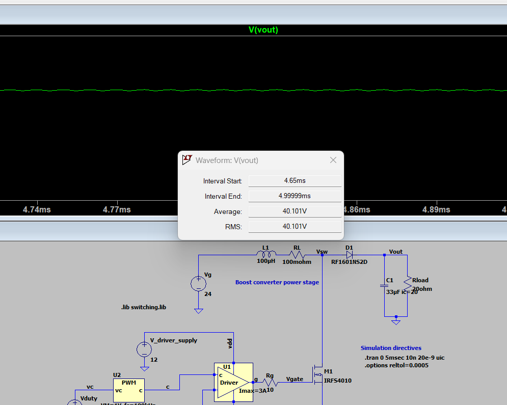

## What	is	the	steady-state average	output	voltage	(expressed	in	volts)?

### 1. The Ideal Math vs. The Real World
If this circuit were 100% perfect and lossless, the math for a boost converter says our $24\text{ V}$ input at a $40\%$ duty cycle ($D = 0.4$) should give us exactly **$40\text{ V}$** on the output:

$$V_{out} = \frac{V_g}{1 - D} = \frac{24\text{ V}}{1 - 0.4} = 40.0\text{ V}$$

### 2. What LTspice Actually Measured
Real circuits have losses, so the simulation won't hit a perfect $40\text{ V}$. After letting the simulation run and settle down ($4.5\text{ ms}$ to $5.0\text{ ms}$), I used `Ctrl + Click` on the `V(vout)` trace to find the true average:

* **Theoretical Perfect Output:** $40.0\text{ V}$
* **Actual Simulated Average :** `40.101 V`

### 3. Where did the missing voltage go?
Our simulated components aren't perfect, and three main culprits are "stealing" that extra voltage:
1. **The Inductor's Wire ($R_L = 100\text{ m}\Omega$):** The inductor has internal copper resistance that burns off power as heat.
2. **The Diode Drop ($D1$):** The `RF1601NS2D` diode takes about $0.8\text{ V}$ to $1\text{ V}$ just to let current pass through it.
3. **The MOSFET Switch ($M1$):** The `IRFS4010` transistor isn't a perfect conductor; it has a tiny internal resistance when turned on.