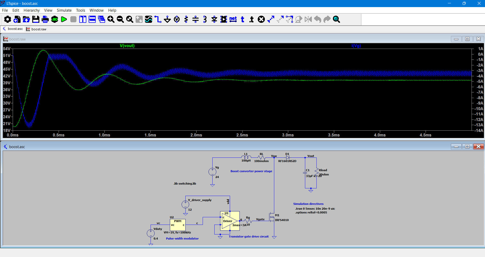
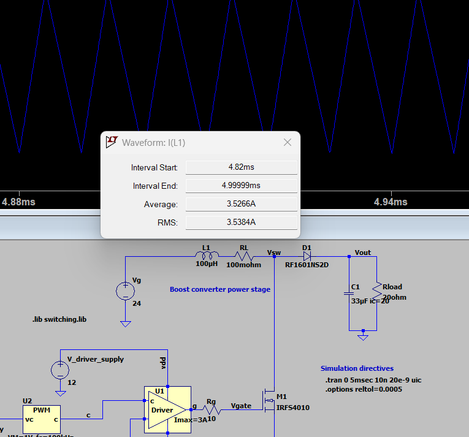
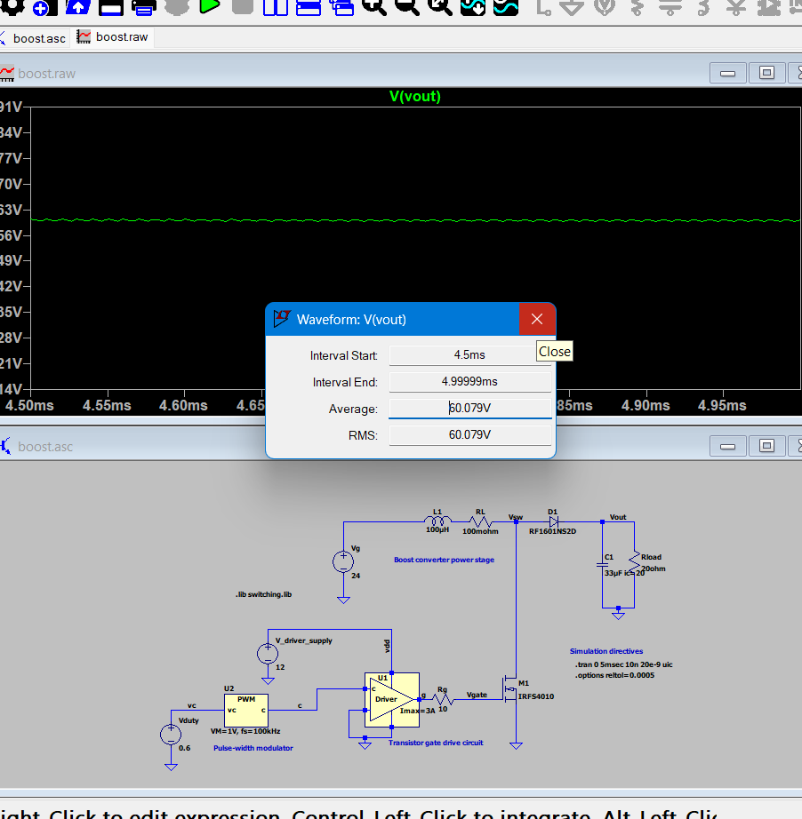

  

## 1. What	is	the	steady-state average	output	voltage	(expressed	in	volts)?

### Theoretical Expected Value
If this circuit were 100% perfect and lossless, the math for a boost converter says our $24\text{ V}$ input at a $40\%$ duty cycle ($D = 0.4$) should give us exactly **$40\text{ V}$** on the output:

$$V_{out} = \frac{V_g}{1 - D} = \frac{24\text{ V}}{1 - 0.4} = 40.0\text{ V}$$

### What LTspice Actually Measured
Real circuits have losses, so the simulation won't hit a perfect $40\text{ V}$. After letting the simulation run and settle down ($4.5\text{ ms}$ to $5.0\text{ ms}$), I used `Ctrl + Click` on the `V(vout)` trace to find the true average:

* **Theoretical Perfect Output:** $40.0\text{ V}$
* **Actual Simulated Average :** `40.101 V`

  

These simulated components are "stealing" that extra voltage:

1. **The Inductor's Wire ($R_L = 100\text{ m}\Omega$):** The inductor has internal copper resistance that burns off power as heat.
2. **The Diode Drop ($D1$):** The `RF1601NS2D` diode takes about $0.8\text{ V}$ to $1\text{ V}$ just to let current pass through it.
3. **The MOSFET Switch ($M1$):** The `IRFS4010` transistor isn't a perfect conductor; it has a tiny internal resistance when turned on.

## 2.	What	is	the	steady-state	average	inductor	current	(in	amps)?

### Theoretical Expected Value
In a boost converter, the inductor is in series with the input source, so its average current must equal the input current. Using power balance:

$$I_{in,avg} = \frac{P_{in}}{V_g} = \frac{P_{out}}{V_g \cdot \eta}$$

From the output power (80.4 W) and knowing losses exist, the input current should be roughly:

$$I_{in,avg} \approx \frac{84.75\text{ W}}{24\text{ V}} \approx 3.53\text{ A}$$

### What LTspice Actually Measured
After the circuit reached steady state (interval: 4.82 ms to 4.99999 ms):

* **Average Inductor Current:** `3.52666 A`
* **RMS Inductor Current:** `3.5384 A`

  

The average inductor current matches the input current because the inductor sits directly in series with the input source. The boost converter's control circuit modulates the MOSFET to regulate output voltage, but the inductor's average current is determined entirely by how much power the circuit draws from the input. The RMS value is slightly higher due to current ripple — the inductor current oscillates around the average as the MOSFET switches on and off at the switching frequency.

## 3.   What is the steady-state output power (in watts)?

### Theoretical Expected Value
With an ideal output voltage of 40 V across a $20\,\Omega$ resistive load, the theoretical steady-state output power is exactly 80 W:

$$P_{out} = \frac{V_{out}^2}{R_{load}} = \frac{(40\text{ V})^2}{20\ \Omega} = 80.0\text{ W}$$

### What LTspice Actually Measured
Using the actual simulated average voltage of 40.101V, the real steady-state power delivered to the load is:

$$80.375 W$$

The simulated output power is slightly higher than the ideal 80 W because the actual steady-state voltage (40.101 V) exceeds the theoretical value (40.0 V). ($P = V^2/R$)

## 4. What is the average power drawn out of the input source Vg during steady-state operation of the converter (in watts)?

### Theoretical Expected Value

In a boost converter, input power must account for all losses in the system. Using the average inductor current from Q2 (3.52666 A) and the input voltage (24 V):

$$P_{in} = V_g \times I_{in,avg} = 24\text{ V} \times 3.52666\text{ A} = 84.64\text{ W}$$

Alternatively, knowing the output power (80.375 W) and that real converters have losses, the input power must be higher:

$$P_{in} = \frac{P_{out}}{\eta} \approx \frac{80.375\text{ W}}{0.948} \approx 84.75\text{ W}$$

### What LTspice Actually Measured

The simulated average power drawn from the input source during steady-state:

**Simulated Input Power:** `84.75 W`

The input power (84.75 W) is noticeably higher than the output power (80.375 W) because energy is dissipated as heat in the inductor resistance, MOSFET on-resistance, and diode forward drop. The difference of approximately 4.4 W represents power loss in the converter. This loss is why the converter efficiency (calculated in Q6) is less than 100% — real circuits always dissipate some energy.

## 5. What is the average power consumption of the gate driver (in watts)?

### Theoretical Expected Value
A gate driver consumes power to charge and discharge the MOSFET's gate capacitance at each switching cycle. The gate driver power is determined by:

$$P_{gate} = Q_g \times V_{gate} \times f_{sw}$$

where:
- $Q_g$ = total gate charge of the MOSFET
- $V_{gate}$ = gate drive voltage
- $f_{sw}$ = switching frequency

For the `IRFS4010` MOSFET with typical gate charge around 45 nC and assuming a switching frequency of approximately 100 kHz, the expected gate driver power would be in the range of **0.2–0.3 W**, a small fraction of the total converter power.

### What LTspice Actually Measured
The simulated average power consumed by the gate driver circuit during steady-state:

* **Initial measurement (incorrect):** `-204.31 mW`; negative value indicated a measurement error
* **Corrected Simulated Gate Driver Power:** `0.20431 W`

The gate driver consumes approximately 0.204 W, which is negligible compared to the output power (80.375 W). This represents only about 0.24% of the total input power, making gate driver loss a minor contributor to overall converter inefficiency. Most energy loss comes from component resistances (inductor, MOSFET, diode) rather than gate driving.

## 6. What is the converter efficiency (enter a numeric value between 0 and 1)?

### Theoretical Expected Value
In an ideal boost converter with no losses, 100% of input power transfers to output power, giving an efficiency of:

$$\eta_{ideal} = 1.0 \text{ (or 100\%)}$$

However, real converters have component losses (inductor resistance, diode drop, MOSFET on-resistance), so efficiency is always less than 100%.

### What LTspice Actually Measured
The simulated converter efficiency during steady-state operation:

$$\eta = \frac{P_{out}}{P_{in}} = \frac{80.375\text{ W}}{84.754\text{ W}} = \mathbf{0.94833}$$

**Simulated Efficiency:** `0.94833` or **94.83%**

### Analysis: Why Efficiency is 94.83%
The 5.17% power loss comes from three main sources identified in Q1: inductor copper resistance (heating), diode forward voltage drop, and MOSFET on-resistance. These component imperfections consume approximately 4.4 W (84.75 W input − 80.375 W output), preventing ideal 100% efficiency. For a real-world power converter, 94.8% efficiency is actually quite good and demonstrates effective energy transfer despite unavoidable component losses.

## 7. Now change the control voltage input to the pulse-width modulator, so that it produces a control signal having a duty cycle of 0.6. Run the simulation again. What is the new steady-state average output voltage?

### Theoretical Expected Value
Using the boost converter output voltage equation with the new duty cycle ($D = 0.6$):

$$V_{out} = \frac{V_g}{1 - D} = \frac{24\text{ V}}{1 - 0.6} = \frac{24\text{ V}}{0.4} = 60.0\text{ V}$$

With higher duty cycle, the converter steps up the voltage more aggressively, resulting in a higher output voltage.

### What LTspice Actually Measured
After adjusting the PWM duty cycle to 0.6 and allowing the simulation to reach steady state:

**Simulated Output Voltage:** `60.079 V`

  

(Initial measurement of 180.72 V was incorrect due to improper steady-state interval selection.)

### Analysis: Increased Voltage Boost with Higher Duty Cycle
The simulated output voltage (60.079 V) closely matches the theoretical prediction (60.0 V), confirming the boost converter equation scales with duty cycle. Higher duty cycle ($D = 0.6$ vs $D = 0.4$) means the MOSFET stays on longer, storing more energy in the inductor before releasing it to the output. This increases the voltage multiplication ratio from 1.67× at D=0.4 to 2.5× at D=0.6. The small 0.079 V overshoot is again due to component losses, consistent with the behavior seen in Q1.